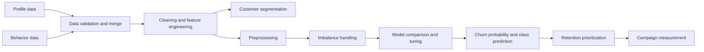

# Customer Churn Prediction

An end-to-end machine learning capstone for identifying customers at risk of churn and translating model scores into retention priorities.

## Business Problem

Customer churn reduces recurring revenue and increases the cost of replacing customers. The business needs an early-warning system that identifies customers who are likely to leave while there is still time to intervene.

This project combines customer profile data and recent customer behavior to estimate the probability of churn for each customer. The output is intended to support targeted retention actions such as service recovery, loyalty outreach, relevant offers, and proactive account contact.

## Business Objective

Build a repeatable churn classification workflow that:

- Identifies high-risk customers before churn occurs.
- Explains the behavioral and commercial signals associated with churn.
- Helps retention teams prioritize limited outreach capacity.
- Produces a customer-level prediction file for downstream action.

The model is a decision-support tool. It should not automatically penalize or restrict customers.

## Key Business Questions

| Question | How this project addresses it |
|---|---|
| Who is most likely to churn? | Customer-level churn predictions and risk ranking. |
| What behaviors signal churn risk? | EDA, engineered behavioral features, correlations, and feature importance. |
| Which customer groups should be prioritized? | KMeans customer segmentation and segment-level churn rates. |
| When should the business intervene? | Use the predicted probability and an intervention threshold aligned to campaign capacity. |
| Why use machine learning? | Churn is influenced by interacting profile, engagement, spend, support, and loyalty signals. |
| How should predictions create value? | Convert risk scores into targeted retention actions and measure incremental retention. |

## Solution Architecture



## Notebook Workflow

`Code.ipynb` contains the complete analysis:

1. Setup and reproducibility configuration.
2. Profile and behavior data loading and merging.
3. Exploratory data analysis and missing-value review.
4. Data cleaning and categorical normalization.
5. Behavioral, spend, engagement, inactivity, support, loyalty, and risk features.
6. KMeans customer segmentation with PCA visualization.
7. Imputation, scaling, and ordinal encoding.
8. SMOTE and Tomek Links experiments for class imbalance.
9. Comparison of Logistic Regression, Decision Tree, Random Forest, Gradient Boosting, XGBoost, and LightGBM.
10. Randomized LightGBM hyperparameter search.
11. Validation metrics, confusion matrix, precision-recall analysis, and feature importance.
12. Full-training-data fit and customer-level submission generation.

## Data

The notebook expects these files in the repository root:

- `train_customer_profile.csv`
- `train_customer_behavior.csv`
- `test_customer_profile.csv`
- `test_customer_behavior.csv`

This repository includes the raw input files and generated prediction artifacts so the complete capstone can be reviewed in one place. Confirm that the data is permitted for public publication before pushing the repository publicly. The input data contains customer-level records and should be treated as potentially sensitive.

The training data contains 15,000 customers and the test data contains 5,000 customers. The merged training table contains 25 columns, including the binary `churn` target. The observed training target distribution is approximately 78.7% retained and 21.3% churned.

### Main fields

- Customer identity: `customer_id`
- Target: `churn`
- Profile: age, tenure, gender, region, income tier, education, marital status
- Commercial behavior: purchase frequency, average order value, total six-month spend, returns ratio
- Engagement: recency, email open rate, app sessions, campaign response rate
- Service and loyalty: support tickets, satisfaction score, product categories, contract type, preferred channel, loyalty tier, promotion usage, payment method

## Model Choice

LightGBM was selected as the leading candidate because it performs well on mixed tabular data, captures nonlinear interactions, trains efficiently, and provides useful feature-importance diagnostics. Logistic Regression provides an interpretable linear baseline, while tree ensembles and boosting models provide progressively more flexible comparisons.

The target is imbalanced, so accuracy alone is not an adequate selection criterion. The analysis emphasizes ROC-AUC, average precision/PR-AUC, churn recall, churn precision, and churn F1-score. The final operating threshold should be chosen with the business cost of missed churn, unnecessary outreach, and available campaign capacity in mind.

## Reported Results

The current notebook outputs report the following validation results for the tuned LightGBM workflow:

| Metric | Reported result |
|---|---:|
| Best cross-validation ROC-AUC | 0.7712 |
| Validation ROC-AUC | 0.7745 |
| Average Precision | 0.5849 |
| Accuracy | 0.7893 |
| Churn precision | 0.50 |
| Churn recall | 0.60 |
| Churn F1-score | 0.5479 |
| Full Tomek-resampled 5-fold ROC-AUC | 0.7773 +/- 0.0093 |
| Test predicted churn rate | 12.22% |

These are the notebook's current reported values, not a guarantee of production performance. Resampling and unsupervised segmentation should ideally be fitted inside each training fold to obtain a fully leakage-safe estimate. A future revision should also include calibration, threshold analysis, confidence intervals, and business-cost evaluation.

## Interpretation and Retention Use

A practical deployment would rank customers by predicted churn probability and divide them into action bands, for example:

- High risk: proactive service recovery or account contact.
- Medium risk: personalized engagement or loyalty intervention.
- Low risk: standard lifecycle communication.

The intervention policy should be tested using an experiment or holdout campaign. Success should be measured by incremental retention, revenue protected, campaign cost, offer cost, and customer experience, rather than model accuracy alone.

## Reproducibility

1. Create a Python 3.10+ environment.
2. Install dependencies:

   ```powershell
   python -m venv .venv
   .\.venv\Scripts\Activate.ps1
   python -m pip install -r requirements.txt
   ```

3. Place the four input CSV files in the repository root.
4. Open `Code.ipynb` in VS Code or Jupyter.
5. Run the notebook from top to bottom.
6. Review the generated file at `outputs/churn_predictions.csv` or the existing root-level prediction artifact.

The notebook uses `SEED = 42` for reproducible random operations. It writes generated outputs to `outputs/` and no longer depends on the original machine-specific absolute paths.

## Limitations and Responsible Use

- The dataset appears to be a structured capstone dataset; external validity must be tested before real-world use.
- A churn prediction is not a causal statement. High-risk customers should receive support, not adverse treatment.
- Demographic and regional fields should be reviewed for fairness and necessity before deployment.
- Model performance can drift as products, pricing, campaigns, and customer behavior change.
- The present notebook's validation design has leakage risks around resampling and clustering; reported metrics should be treated as provisional until corrected with fold-safe pipelines.
- Feature importance describes predictive association, not causal impact.
- Customer identifiers and raw records must be protected and excluded from public repositories unless publication is explicitly authorized.

## Repository Structure

```text
.
├── Business_Brief.pdf
├── Code.ipynb
├── README.md
├── requirements.txt
├── .gitignore
├── Submissions.csv
├── churn_predictions.csv
├── train_customer_profile.csv
├── train_customer_behavior.csv
├── test_customer_profile.csv
├── test_customer_behavior.csv
└── train_df.csv
```
