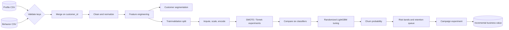
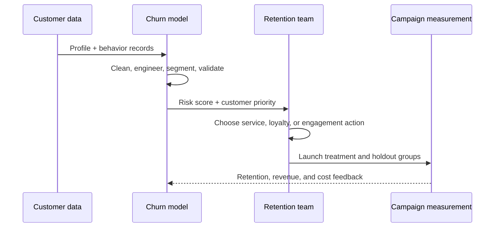
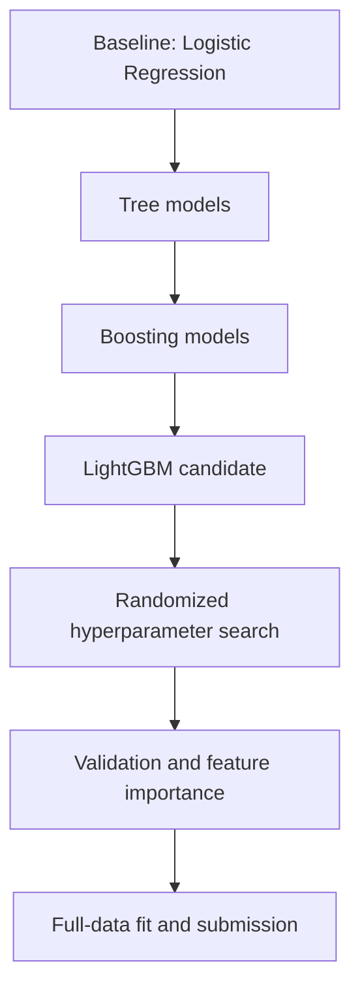

# Customer Churn Prediction

<div align="center">

### An engineering-grade churn decisioning system

A production-oriented machine learning workflow that turns high-volume customer behavior into governed, explainable, and measurable retention decisions.


📊 **15,000** training customers &nbsp;|&nbsp; 🎯 **21.3%** churn prevalence &nbsp;|&nbsp; 🚀 **0.7745** validation ROC-AUC

</div>

> **Executive takeaway:** This is not a classroom-only churn exercise. It is a production-oriented reference workflow designed around data contracts, leakage controls, reproducible feature engineering, imbalance-aware validation, complex tabular modeling, drift-conscious monitoring, and measurable retention impact.

## 🏭 Engineering-Grade by Design

| Production concern | How the workflow addresses it | Business impact |
|:---|:---|:---|
| 🔒 **Data leakage** | Customer-key integrity checks, explicit train/validation boundaries, and a validation-first modeling narrative | Metrics are intended to reflect future decision quality, not accidental information sharing |
| 🧹 **Data quality** | Cleaning, normalization, missing-value analysis, outlier treatment, and engineered behavioral signals | More stable features and fewer silent data-quality failures |
| 🧠 **Complex modeling** | Segmentation, imbalance experiments, six classifier families, and tuned LightGBM | Captures nonlinear interactions that simple rules or linear models can miss |
| 📉 **Data drift** | Reproducible feature definitions and a monitoring-ready output contract for recurring score generation | Makes changes in customer behavior visible before model value degrades |
| 🔁 **Reproducibility** | Fixed `SEED = 42`, relative paths, declared dependencies, and a single executable notebook | Enables repeatable reruns, review, and controlled handover |
| 📊 **Business measurement** | Risk bands tied to campaign capacity, holdout testing, retention lift, and revenue protection | Connects predictive performance to commercial value |

> **Important:** No model can be permanently “drift-free.” Production quality means detecting drift, defining retraining triggers, and preventing degraded scores from silently driving decisions.

## 🌐 Business Context

Customer churn reduces recurring revenue and increases replacement cost. The business needs an early-warning system that identifies customers who may leave while there is still time to improve their experience.

This project joins customer profile and behavioral data, applies a controlled cleaning and feature-engineering layer, compares multiple classifiers, tunes a gradient-boosted champion candidate, and produces a customer-level prediction file for downstream retention action.

### 🎯 Business objective

Build a repeatable workflow that:

- Identifies high-risk customers before churn occurs.
- Explains the behavioral and commercial signals associated with churn.
- Helps retention teams prioritize limited outreach capacity.
- Produces predictions that can be evaluated through controlled campaigns.

## ❓ The WH Questions

| Business question | Analytical answer |
|---|---|
| **Who** is likely to churn? | Rank customers using predicted churn probability. |
| **What** signals risk? | Examine recency, spend, engagement, support, contract, and loyalty features. |
| **Where** is the opportunity? | Compare KMeans customer segments and segment-level churn rates. |
| **When** should we intervene? | Set a threshold using risk, recency, customer lifecycle, and campaign capacity. |
| **Why** use machine learning? | Churn is driven by interacting nonlinear signals across multiple data domains. |
| **How** does this create value? | Convert scores into action bands and measure incremental retention, revenue, and cost. |

## 🧭 End-to-End Architecture



### 🔄 Decision journey



## 📦 Data at a Glance

<div align="center">

| Training customers | Test customers | Training columns | Retained | Churned |
|---:|---:|---:|---:|---:|
| **15,000** | **5,000** | **25** | **11,812** | **3,188** |

</div>

The repository contains the complete project inputs and outputs:

- `train_customer_profile.csv` and `train_customer_behavior.csv`
- `test_customer_profile.csv` and `test_customer_behavior.csv`
- `train_df.csv`, `Submissions.csv`, and `churn_predictions.csv`
- `Business_Brief.pdf` and the executable analysis notebook

⚠️ These are customer-level records. Confirm data-publication permissions before sharing the repository outside the intended audience.

### Feature families

| Family | Example signals | Business interpretation |
|---|---|---|
| 👤 Profile | Age, tenure, region, income tier | Customer context and lifecycle |
| 💳 Commercial | Purchase frequency, order value, six-month spend | Relationship depth and value |
| 📱 Engagement | Recency, app sessions, email opens, campaign response | Activity and attention |
| 🛠️ Service | Support tickets, satisfaction, returns ratio | Friction and experience quality |
| 💎 Loyalty | Contract type, loyalty tier, promotion usage | Stickiness and incentive history |

See [DATA_DICTIONARY.md](DATA_DICTIONARY.md) for the field-level reference.

## 🧪 Modeling Strategy

The notebook follows a deterministic, reproducible modeling path:



### Why LightGBM?

LightGBM is the leading candidate because it:

1. Performs strongly on structured tabular data.
2. Captures nonlinear interactions between customer behaviors.
3. Trains efficiently for repeated experimentation.
4. Provides useful feature-importance diagnostics.
5. Complements the interpretable Logistic Regression baseline.

The analysis compares Logistic Regression, Decision Tree, Random Forest, Gradient Boosting, XGBoost, and LightGBM. Class imbalance is investigated with SMOTE and Tomek Links.

## 📈 Model Scoreboard

The current notebook reports these comparison results:

| Sampling strategy | Model | ROC-AUC | F1 | Average Precision |
|:---|:---|---:|---:|---:|
| SMOTE | LightGBM | **0.7718** | 0.5088 | 0.5707 |
| Tomek Links | LightGBM | 0.7687 | **0.5585** | **0.5805** |
| Tomek Links | Gradient Boosting | 0.7701 | 0.4960 | 0.5683 |
| Tomek Links | XGBoost | 0.7570 | 0.5439 | 0.5493 |
| Tomek Links | Random Forest | 0.7634 | 0.4165 | 0.5536 |

### 🏆 Tuned LightGBM validation snapshot

<div align="center">

| Metric | Result |
|:---|---:|
| Best cross-validation ROC-AUC | **0.7712** |
| Validation ROC-AUC | **0.7745** |
| Average Precision / PR-AUC | **0.5849** |
| Accuracy | **78.93%** |
| Churn precision | **50.00%** |
| Churn recall | **60.00%** |
| Churn F1-score | **0.5479** |
| Full Tomek 5-fold ROC-AUC | **0.7773 +/- 0.0093** |
| Test predicted churn rate | **12.22%** |

</div>

> **Metric choice matters:** because churn is a minority class, accuracy alone can hide missed churners. ROC-AUC, PR-AUC, recall, precision, and F1 are reported together so the operating trade-off is visible.

## 💡 From Prediction to Action

| Risk band | Suggested action | Measurement |
|:---|:---|:---|
| 🔴 High risk | Proactive service recovery or account contact | Retention lift and revenue protected |
| 🟠 Medium risk | Personalized loyalty or engagement intervention | Response and conversion rate |
| 🟢 Low risk | Standard lifecycle communication | Cost-efficient baseline retention |

The threshold should be chosen using campaign capacity and the relative cost of missed churn versus unnecessary outreach. The strongest next step is a holdout or A/B campaign measuring **incremental retention**, not just model accuracy.

## 📓 Notebook Workflow

[Code.ipynb](Code.ipynb) contains the complete analysis:

1. Setup and reproducibility configuration with `SEED = 42`.
2. Profile and behavior loading, key validation, and merging.
3. Exploratory data analysis and missing-value review.
4. Data cleaning and categorical normalization.
5. Spend, engagement, inactivity, support, loyalty, and risk features.
6. KMeans segmentation with PCA visualization.
7. Imputation, scaling, and ordinal encoding.
8. SMOTE and Tomek Links imbalance experiments.
9. Six-model comparison and LightGBM tuning.
10. Evaluation, confusion matrix, precision-recall analysis, and feature importance.
11. Full-training-data fit and customer-level prediction generation.

## 🚀 Run Locally

```powershell
python -m venv .venv
.\.venv\Scripts\Activate.ps1
python -m pip install -r requirements.txt
```

Open `Code.ipynb` in VS Code or Jupyter and run it from top to bottom. The notebook uses repository-relative paths and writes generated predictions to `outputs/churn_predictions.csv`.

## ⚠️ Limitations and Responsible Use

- The current metrics are notebook-reported results, not a production guarantee.
- Resampling and unsupervised segmentation should be fitted inside each validation fold for a fully leakage-safe estimate.
- Calibration, threshold economics, confidence intervals, and slice-based fairness checks should be added before deployment.
- Feature importance shows predictive association, not causality.
- A high-risk prediction should trigger helpful support, never adverse treatment.
- Demographic fields should be reviewed for fairness, necessity, and governance.
- Customer identifiers and raw records require appropriate access controls.

## 🗂️ Repository Map

```text
.
├── Business_Brief.pdf              # Original business requirements
├── Code.ipynb                      # Complete analysis and model workflow
├── DATA_DICTIONARY.md              # Feature-level reference
├── README.md                       # Project narrative and operating guide
├── requirements.txt                # Python dependencies
├── train_customer_profile.csv      # Training profile data
├── train_customer_behavior.csv     # Training behavior data
├── test_customer_profile.csv       # Test profile data
├── test_customer_behavior.csv      # Test behavior data
├── train_df.csv                    # Merged training artifact
├── Submissions.csv                 # Existing submission artifact
└── churn_predictions.csv           # Existing prediction artifact
```
